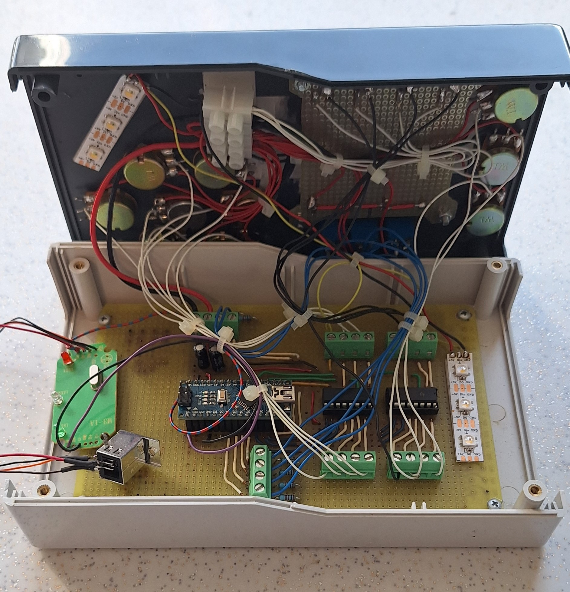
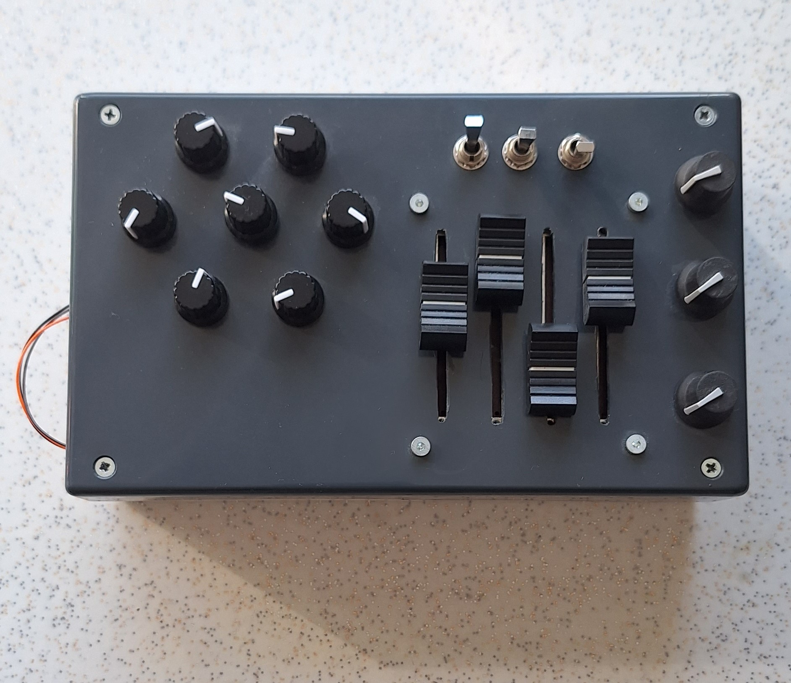

# MIDI Controller with Potentiometers and Buttons

This project is a custom-built MIDI controller using an Arduino. It reads values from multiple rotary and slider potentiometers, as well as buttons, and sends corresponding MIDI Control Change (CC) signals over serial.
A MIDI-to-Serial converter connected between the Arduino and a USB-B port converts the serial data into proper MIDI signals, making the device fully compatible with any DAW (Digital Audio Workstation).

## Features
The system allows for fully customizable MIDI Control Change (CC) numbers, giving users complete flexibility to assign any control to any parameter within 
their DAW through a Serial-To-MIDI conversion.
Thanks to smooth input filtering, the potentiometer readings are stable and accurate, ensuring a professional control experience.

MIDI data is sent via Serial and then converted with a Serial-to-MIDI converter, making the controller fully compatible with any Digital Audio Workstation (DAW).

## Hardware Setup
This project features 10 rotary potentiometers and 4 linear slider potentiometers, along with 3 toggle switches for additional MIDI input functions. 
The rotary potentiometers are connected through two 8-channel analog multiplexers (74HC4051), while the slider potentiometers are directly connected 
to analog inputs. The toggle switches are wired to digital input pins.
A MIDI-to-Serial converter (external module) translates the Arduino's Serial output into true MIDI signals, making the device fully compatible with any DAW. 
The wiring setup includes multiplexer control pins connected to digital pins 2, 3, and 4; multiplexer outputs connected to analog pins A0 and A1; 
slider potentiometers connected to analog pins A2, A3, A4, and A5; and toggle switches connected to digital pins 5 through 10.

## Software
The Arduino firmware is designed to operate in a continuous loop, where it reads and applies low-pass filtering to the analog inputs from the rotary and 
slider potentiometers to ensure smooth and stable data acquisition. The filtered analog values are then mapped to the standard 7-bit MIDI resolution 
range (0–127), suitable for MIDI Control Change messages. The software also monitors the digital inputs connected to the toggle switches, 
detecting both state changes and steady states. Upon any detected change—whether from a potentiometer movement or a switch activation—the Arduino sends 
the corresponding MIDI message over the Serial interface,  ensuring real-time communication with the connected MIDI-to-Serial converter and ultimately with any DAW or MIDI-compatible device.

## MIDI Message Format
Each MIDI message transmitted by the Arduino consists of three bytes: the MIDI Control Change status byte (default value: 176), the Controller Number (which is individually assigned to each knob, slider, or switch), and the Controller Value (ranging from 0 to 127, in accordance with standard 7-bit MIDI resolution). The selected MIDI channel, represented by the status byte 176, corresponds to MIDI Channel 1 and is intentionally left unreserved, providing users with the flexibility to customize the controller assignments according to their specific workflow requirements.

## Customization
You can easily change the assigned MIDI CC numbers by editing the arrays in the Arduino code:

int dNum[] = { ... }; // Rotary knobs

int sNum[] = { ... }; // Slider faders

int bNum[] = { ... }; // Buttons

You can also adjust the MIDI Channel by changing the CC variable:

int CC = 176; // Change 176 to another Control Change status byte if needed

## Notes

Ensure that your Digital Audio Workstation (DAW) is configured to accept external MIDI controller input for proper functionality. Additionally, the design is modular and can be easily expanded by adding more multiplexers, allowing you to incorporate additional controls as needed.Ensure that your Digital Audio Workstation (DAW) is configured to accept external MIDI controller input for proper functionality. Additionally, the design is modular and can be easily expanded by adding more multiplexers, allowing you to incorporate additional controls as needed.

## The device

